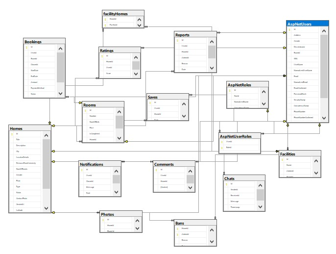

# 🏠 UNISTAY - Student Housing Management System

## 📋 Project Description

**UNISTAY** is a comprehensive student housing rental management system that provides an easy-to-use platform connecting property owners with students seeking suitable accommodation. The system supports complete property and booking management with a modern, interactive user interface.

## ✨ Key Features

### 👥 For Students (Users)
- **Search & Filter**: Find houses and rooms by location, price, and amenities
- **Compare Properties**: Save and compare multiple properties
- **Booking & Payment**: Book rooms with multiple payment methods (Stripe + Cash)
- **Communication**: Direct messaging system with property owners
- **Reviews & Comments**: Rate properties and leave reviews
- **Report Issues**: Report suspicious properties
- **Profile Management**: Manage personal information and password

### 🏘️ For Property Owners
- **Property Management**: Add, edit, and delete houses and rooms
- **Booking Management**: View and manage all bookings
- **Amenity Management**: Add and modify property amenities
- **Tenant Communication**: Direct messaging with students
- **Statistics Dashboard**: Detailed statistics about properties and bookings

### 👨‍💼 For Administrators
- **Property Approval**: Review and approve new properties
- **User Management**: Manage all users and property owners
- **Report Management**: Review and handle incoming reports
- **Amenity Management**: Add and modify available amenities
- **Ban Management**: Ban violating users

## 🛠️ Technologies Used

### Frontend
- **React 19** - User interface library
- **Vite** - Fast build tool
- **React Router DOM** - Navigation management
- **Axios** - HTTPS requests
- **React Google Maps API** - Interactive maps
- **Stripe React** - Payment processing
- **SignalR** - Real-time communication
- **React Toastify** - User notifications
- **SweetAlert2** - Beautiful popups
- **Lottie React** - Animations
- **Lucide React** - Icons

### Backend
- **ASP.NET Core 8** - Backend framework
- **Entity Framework Core** - Database ORM
- **SQL Server** - Database
- **JWT Authentication** - Authentication
- **SignalR** - Real-time communication
- **Stripe.NET** - Payment processing
- **Google Authentication** - Google login
- **Swagger** - API documentation

### Advanced Features
- **Real-time Chat** - Live messaging
- **File Upload** - Image and file uploads
- **Geolocation** - Location mapping
- **Payment Integration** - Payment processing
- **Push Notifications** - Instant notifications
- **Responsive Design** - Mobile-friendly design

## 🚀 Getting Started

### Prerequisites
- Node.js (v18 or later)
- .NET 8 SDK
- SQL Server
- Visual Studio 2022 or VS Code

### Installation and Setup

1. **Clone the Repository**
```bash
git clone https://github.com/your-username/ESH-Housing-System.git
cd ESH-Housing-System/FinalGP
```

2. **Install Frontend Dependencies**
```bash
cd finalgp.client
npm install
```

3. **Install Backend Dependencies**
```bash
cd ../FinalGP.Server
dotnet restore
```

4. **Setup Database**
```bash
dotnet ef database update
```

5. **Run the Project**
```bash
# Run Backend
dotnet run

# In another terminal, run Frontend
cd finalgp.client
npm run dev
```

6. **Open the Application**
- Frontend: `https://localhost:55559`
- Backend API: `https://localhost:7194`
- Swagger Documentation: `https://localhost:7194/swagger`

## 📁 Project Structure

```
FinalGP/
├── finalgp.client/          # React Frontend
│   ├── src/
│   │   ├── components/      # Shared components
│   │   ├── UserPages/       # User pages
│   │   ├── Owner-pages/     # Property owner pages
│   │   ├── Admin-pages/     # Admin pages
│   │   └── ...
│   └── public/
├── FinalGP.Server/          # ASP.NET Core Backend
│   ├── Controllers/         # API controllers
│   ├── Models/             # Data models
│   ├── DTO/                # Data transfer objects
│   ├── RepositoryLayer/    # Data access layer
│   ├── ServiceLayer/       # Business logic layer
│   └── wwwroot/            # Static files
└── ...
```


## 🔐 Security

- **JWT Authentication** - Secure authentication
- **Role-based Authorization** - Role-based permissions
- **Input Validation** - Input sanitization
- **File Upload Security** - Secure file uploads
- **SQL Injection Protection** - Database security

## 📱 Interactive Features

- **Real-time Notifications** - Instant notifications
- **Live Chat** - Real-time messaging
- **Interactive Maps** - Location mapping
- **Image Gallery** - Photo galleries
- **Responsive UI** - Mobile-friendly interface

## 🤝 Contributing

We welcome contributions! Please follow these steps:

1. Fork the project
2. Create a new branch (`git checkout -b feature/AmazingFeature`)
3. Commit your changes (`git commit -m 'Add some AmazingFeature'`)
4. Push to the branch (`git push origin feature/AmazingFeature`)
5. Open a Pull Request

## 📚 API Documentation

### Authentication Endpoints
- `POST /api/Authentication/Register` — Register a new user (with role selection)
- `POST /api/Authentication/Login` — User login
- `POST /api/Authentication/GoogleRegister` — Google OAuth registration
- `POST /api/Authentication/GoogleLogin` — Google OAuth login
- `POST /api/Authentication/ForgotPassword` — Request password reset
- `POST /api/Authentication/ResetPassword` — Reset password
- `POST /api/Authentication/RefreshToken` — Refresh JWT token

### User Endpoints
- `GET /api/User/Profile` — Get user profile
- `PUT /api/User/Profile` — Update user profile
- `POST /api/User/ChangePassword` — Change password
- `GET /api/User/Notifications` — Get user notifications

### Property (Home) Endpoints
- `GET /api/Homes` — List all homes
- `GET /api/Homes/{id}` — Get home details
- `POST /api/Homes` — Add new home (Owner only)
- `PUT /api/Homes/{id}` — Update home (Owner only)
- `DELETE /api/Homes/{id}` — Delete home (Owner only)
- `GET /api/Homes/Owner/{ownerId}` — Get homes by owner

### Room Endpoints
- `GET /api/Rooms/Home/{homeId}` — Get rooms for a home
- `POST /api/Rooms` — Add new room (Owner only)
- `PUT /api/Rooms/{id}` — Update room (Owner only)
- `DELETE /api/Rooms/{id}` — Delete room (Owner only)

### Booking Endpoints
- `POST /api/Bookings` — Book a room
- `GET /api/Bookings/User/{userId}` — Get user bookings
- `GET /api/Bookings/Owner/{ownerId}` — Get bookings for owner's homes
- `PUT /api/Bookings/{id}/Status` — Update booking status

### Chat & Notification Endpoints
- `GET /api/Chats/User/{userId}` — Get user chats
- `POST /api/Chats` — Start new chat
- `GET /api/Messages/{chatId}` — Get chat messages
- `POST /api/Messages` — Send message
- `GET /api/Notifications/User/{userId}` — Get notifications

### Admin Endpoints
- `GET /api/Admin/PendingHomes` — Get pending homes for approval
- `PUT /api/Admin/Homes/{id}/Status` — Approve/reject home
- `GET /api/Admin/Reports` — Get all reports
- `PUT /api/Admin/Reports/{id}/Status` — Update report status
- `GET /api/Admin/Users` — Get all users
- `PUT /api/Admin/Users/{id}/Ban` — Ban/unban user

### Facility Endpoints
- `GET /api/Facilities` — List all facilities
- `POST /api/Facilities` — Add facility (Admin only)
- `PUT /api/Facilities/{id}` — Update facility (Admin only)
- `DELETE /api/Facilities/{id}` — Delete facility (Admin only)

### Ratings, Comments, Reports, Saves
- `POST /api/Ratings` — Rate a home
- `POST /api/Comments` — Add comment to home
- `POST /api/Reports` — Report a home
- `POST /api/Saves` — Save a home to favorites
- `DELETE /api/Saves/{id}` — Remove home from favorites

> For full details and request/response formats, see the integrated Swagger documentation at `/swagger`.

## 📄 License

This project is licensed under the MIT License - see the [LICENSE](LICENSE) file for details.

## 📞 Support

If you encounter any issues or have questions, please:
- Open a new Issue
- Contact us via email
- Check the Swagger documentation

## 🗄️ Database Structure

Below is the Entity Relationship Diagram (ERD) for the UNISTAY system:



🎥 **Watch the Demo:**  
[https://drive.google.com/file/d/1Lf6vES3d7WOv9Hf2NKdiTwmawubq8WOc/view?usp=drive_link](https://drive.google.com/file/d/1Lf6vES3d7WOv9Hf2NKdiTwmawubq8WOc/view?usp=drive_link)

## 🙏 Acknowledgments

Special thanks to all contributors and developers who helped develop this project, especially my amazing teammates:

- [Radwa Mostafa](https://www.linkedin.com/in/radwa-mostafa56/)
- [Shahd Mohammed](https://www.linkedin.com/in/shahd-mohammed-b2aa742a7/)
- [Shahd Mohammed](https://www.linkedin.com/in/shahd-mohammed-7111ba311/)
- [Adham Mohamed](https://www.linkedin.com/in/adham-mohamed-8a8643285/)

---

**Developed by the UNISTAY Team** 🚀
